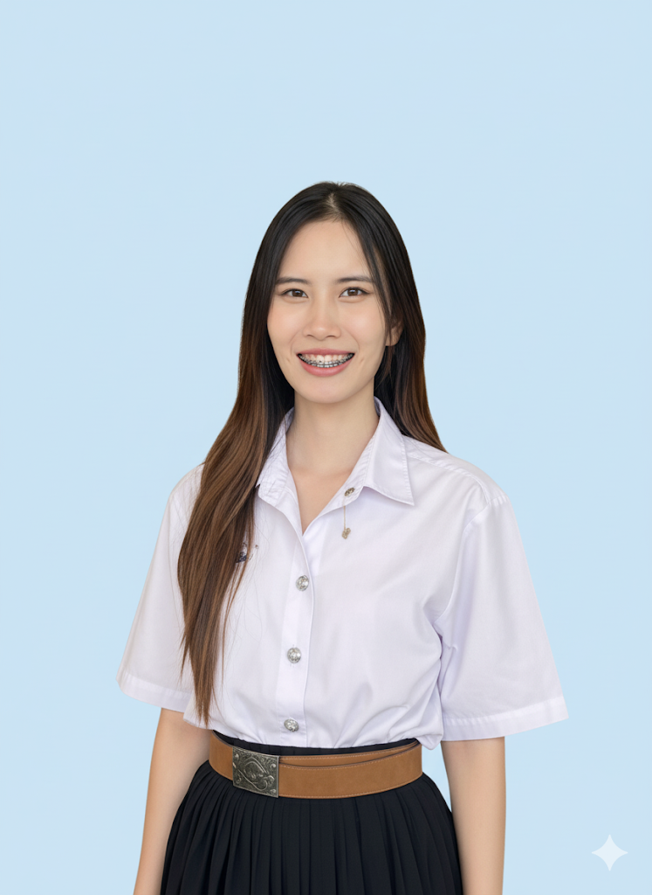

<!-- Banner / Cover -->

  

<h1 align="center">Hi, I’m ⟪Wipada⟫ </h1>

  <strong>Software Tester • QA Automation 
  <em>“Ensuring software quality through smart testing and automation”</em>

---

## 🚀 About Me

- 🌱 I’m currently learning **⟪Robot Framework⟫**
- 🛠 Daily driver stack: **⟪Selenium, Appium⟫**
- 🎯 2025 Goal: **⟪Improve testing process through the adoption of new tools (e.g., Appium)⟫**
- 📫 Reach me: **⟪Wipadapancharoen217@gmail.com⟫** | [Facebook](https://www.facebook.com/m.a.gic.c.268362/)

---

## 🧰 Tech Stack & Tools

| Domain       | Primary                                                                                                                                                                   | Comfortable                                                                                                                                                | Currently Exploring                                                                                           |
| ------------ | ------------------------------------------------------------------------------------------------------------------------------------------------------------------------- | ---------------------------------------------------------------------------------------------------------------------------------------------------------- | ------------------------------------------------------------------------------------------------------------- |
| Test Tools   |   |  |
| Languages    |  

---

## 📌 Featured Projects

| Project         | Tech                      | Highlights                               
| --------------- | ------------------------- | -----------------------------------------
| **⟪Home EV Charger Booking System⟫** | Selenium · Appium | Automation Testing 

---

## ✍🏻 Recent Blog / Talks

<!-- GH Action can automate this section; placeholder for manual list -->

- ⟪2025⟫ • Participant, Agile Workshop
- ⟪2024⟫ • Participant, IT Camp

---

## 📈 GitHub Stats

  
  

---

## 🤝 Let’s Connect

> **“Great products are built by great people working together.”**

- 💌 Email: ⟪Wipadapancharoen217@gmail.com⟫
- 🐦 DM me on [Facebook](https://www.facebook.com/m.a.gic.c.268362/)

  

